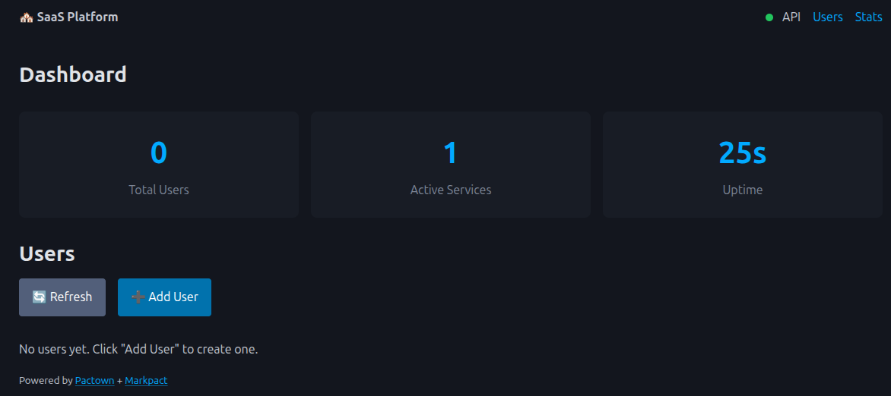

# Pactown 🏘️

**Decentralized Service Ecosystem Orchestrator** – Build interconnected microservices from Markdown using [markpact](https://github.com/wronai/markpact).

[](https://www.python.org/downloads/)
[](LICENSE)

## Overview

Pactown enables you to compose multiple independent markpact projects into a unified, decentralized service ecosystem. Each service is defined in its own `README.md`, runs in its own sandbox, and communicates with other services through well-defined interfaces.

```
┌─────────────────────────────────────────────────────────────────┐
│                     Pactown Ecosystem                           │
├─────────────────────────────────────────────────────────────────┤
│                                                                 │
│  ┌──────────┐    ┌──────────┐    ┌──────────┐    ┌──────────┐   │
│  │   Web    │───▶│   API    │───▶│ Database │    │   CLI    │   │
│  │ :8002    │    │  :8001   │    │  :8003   │    │  shell   │   │
│  │ React    │    │ FastAPI  │    │ Postgres │    │  Python  │   │
│  └──────────┘    └──────────┘    └──────────┘    └──────────┘   │
│       │               │               │               │         │
│       ▼               ▼               ▼               ▼         │
│  ┌──────────────────────────────────────────────────────────┐   │
│  │              markpact sandboxes (isolated)               │   │
│  └──────────────────────────────────────────────────────────┘   │
│                                                                 │
└─────────────────────────────────────────────────────────────────┘
```

## Key Features

### Core Features
- **🔗 Service Composition** – Combine multiple markpact READMEs into one ecosystem
- **📦 Local Registry** – Store and share markpact artifacts across projects
- **🔄 Dependency Resolution** – Automatic startup order based on service dependencies
- **🏥 Health Checks** – Monitor service health with configurable endpoints
- **🌐 Multi-Language** – Mix Python, Node.js, Go, Rust in one ecosystem
- **🔒 Isolated Sandboxes** – Each service runs in its own environment
- **🔌 Dynamic Ports** – Automatic port allocation when preferred ports are busy
- **🔍 Service Discovery** – Name-based service lookup, no hardcoded URLs
- **⚡ Config Generator** – Auto-generate config from folder of READMEs

### New in v0.4.0
- **⚡ Fast Start** – Dependency caching for millisecond startup times ([docs](docs/FAST_START.md))
- **🛡️ Security Policy** – Rate limiting, user profiles, anomaly logging ([docs](docs/SECURITY_POLICY.md))
- **👤 User Isolation** – Linux user-based sandbox isolation for multi-tenant SaaS ([docs](docs/USER_ISOLATION.md))
- **📊 Detailed Logging** – Structured logs with error capture ([docs](docs/LOGGING.md))

---

## 📚 Documentation

### Quick Navigation

| Category | Documents |
|----------|-----------|
| **Getting Started** | [Quick Start](#quick-start) · [Installation](#installation) · [Commands](#commands) |
| **Core Concepts** | [Specification](docs/SPECIFICATION.md) · [Configuration](docs/CONFIGURATION.md) · [Network](docs/NETWORK.md) |
| **Deployment** | [Deployment Guide](docs/DEPLOYMENT.md) · [Quadlet/VPS](docs/QUADLET.md) · [Generator](docs/GENERATOR.md) |
| **Security** | [Security Policy](docs/SECURITY_POLICY.md) · [Quadlet Security](docs/SECURITY.md) · [User Isolation](docs/USER_ISOLATION.md) |
| **Performance** | [Fast Start](docs/FAST_START.md) · [Logging](docs/LOGGING.md) |
| **Comparisons** | [vs Cloudflare Workers](docs/CLOUDFLARE_WORKERS_COMPARISON.md) |

### All Documentation

| Document | Description |
|----------|-------------|
| [Specification](docs/SPECIFICATION.md) | Architecture and design |
| [Configuration](docs/CONFIGURATION.md) | YAML config reference |
| [Deployment](docs/DEPLOYMENT.md) | Production deployment guide (Compose/Kubernetes/Quadlet) |
| [Network](docs/NETWORK.md) | Dynamic ports & service discovery |
| [Generator](docs/GENERATOR.md) | Auto-generate configs |
| [Quadlet](docs/QUADLET.md) | Podman Quadlet deployment for VPS production |
| [Security](docs/SECURITY.md) | Quadlet security hardening and injection test suite |
| [Security Policy](docs/SECURITY_POLICY.md) | Rate limiting, user profiles, resource monitoring |
| [Fast Start](docs/FAST_START.md) | Dependency caching for fast startup |
| [User Isolation](docs/USER_ISOLATION.md) | Linux user-based sandbox isolation |
| [Logging](docs/LOGGING.md) | Structured logging and error capture |
| [Cloudflare Workers comparison](docs/CLOUDFLARE_WORKERS_COMPARISON.md) | When to use Pactown vs Cloudflare Workers |

### Source Code Reference

| Module | Description |
|--------|-------------|
| [`config.py`](src/pactown/config.py) | Configuration models |
| [`orchestrator.py`](src/pactown/orchestrator.py) | Service lifecycle management |
| [`resolver.py`](src/pactown/resolver.py) | Dependency resolution |
| [`network.py`](src/pactown/network.py) | Port allocation & discovery |
| [`generator.py`](src/pactown/generator.py) | Config file generator |
| [`service_runner.py`](src/pactown/service_runner.py) | High-level service runner API |
| [`security.py`](src/pactown/security.py) | Security policy & rate limiting |
| [`fast_start.py`](src/pactown/fast_start.py) | Dependency caching & fast startup |
| [`user_isolation.py`](src/pactown/user_isolation.py) | Linux user isolation for multi-tenant |
| [`sandbox_manager.py`](src/pactown/sandbox_manager.py) | Sandbox lifecycle management |
| [`registry/`](src/pactown/registry/) | Local artifact registry |
| [`deploy/`](src/pactown/deploy/) | Deployment backends (Docker, Podman, K8s, Quadlet) |

---

## 🎯 Examples

| Example | What it shows |
|---------|---------------|
| [`examples/saas-platform/`](examples/saas-platform/) | Complete SaaS with Web + API + Database + Gateway |
| [`examples/quadlet-vps/`](examples/quadlet-vps/) | VPS setup and Quadlet workflow |
| [`examples/email-llm-responder/`](examples/email-llm-responder/) | Email automation with LLM integration |
| [`examples/api-gateway-webhooks/`](examples/api-gateway-webhooks/) | API gateway / webhook handler |
| [`examples/realtime-notifications/`](examples/realtime-notifications/) | WebSocket + SSE real-time notifications |
| [`examples/microservices/`](examples/microservices/) | Multi-language microservices |
| [`examples/fast-start-demo/`](examples/fast-start-demo/) | **NEW:** Fast startup with dependency caching |
| [`examples/security-policy/`](examples/security-policy/) | **NEW:** Rate limiting and user profiles |
| [`examples/user-isolation/`](examples/user-isolation/) | **NEW:** Multi-tenant user isolation |

## Installation

```bash
pip install pactown
```

Or install from source:

```bash
git clone https://github.com/wronai/pactown
cd pactown
make install
```

## Quick Start

### 1. Create ecosystem configuration

```yaml
# saas.pactown.yaml
name: my-saas
version: 0.1.0

services:
  api:
    readme: services/api/README.md
    port: 8001
    health_check: /health

  web:
    readme: services/web/README.md
    port: 8002
    depends_on:
      - name: api
        endpoint: http://localhost:8001
```

### 2. Create service READMEs

Each service is a standard markpact README:

````markdown
# API Service

REST API for the application.

---

```python markpact:deps
fastapi
uvicorn
```

```python markpact:file path=main.py
from fastapi import FastAPI
app = FastAPI()

@app.get("/health")
def health():
    return {"status": "ok"}
```

```bash markpact:run
uvicorn main:app --port ${MARKPACT_PORT:-8001}
```
````

### 3. Start the ecosystem

```bash
pactown up saas.pactown.yaml
```


```bash
INFO:     127.0.0.1:57432 - "GET /health HTTP/1.1" 200 OK
INFO:     127.0.0.1:59272 - "GET /health HTTP/1.1" 200 OK
127.0.0.1 - - [15/Jan/2026 14:15:17] "GET /health HTTP/1.1" 200 -
INFO:     127.0.0.1:59300 - "GET /health HTTP/1.1" 200 OK
                Ecosystem: saas-platform                 
┏━━━━━━━━━━┳━━━━━━━┳━━━━━━━━━━━━┳━━━━━━━━┳━━━━━━━━━━━━━━┓
┃ Service  ┃ Port  ┃ Status     ┃ PID    ┃ Health       ┃
┡━━━━━━━━━━╇━━━━━━━╇━━━━━━━━━━━━╇━━━━━━━━╇━━━━━━━━━━━━━━┩
│ database │ 10000 │ 🟢 Running │ 534102 │ ✓ 22ms       │
│ api      │ 10001 │ 🟢 Running │ 534419 │ ✓ 23ms       │
│ web      │ 10002 │ 🟢 Running │ 534424 │ ✓ 29ms       │
│ cli      │ 10003 │ 🔴 Stopped │ 534734 │ Process died │
│ gateway  │ 10004 │ 🟢 Running │ 535242 │ ✓ 23ms       │
└──────────┴───────┴────────────┴────────┴──────────────┘

Press Ctrl+C to stop all services

127.0.0.1 - - [15/Jan/2026 14:15:29] "GET / HTTP/1.1" 200 -
INFO:     127.0.0.1:42964 - "GET / HTTP/1.1" 200 OK
INFO:     127.0.0.1:53998 - "GET /health HTTP/1.1" 200 OK
INFO:     127.0.0.1:54008 - "GET /api/stats HTTP/1.1" 200 OK
INFO:     127.0.0.1:36100 - "GET /records/users HTTP/1.1" 200 OK
INFO:     127.0.0.1:54012 - "GET /api/users HTTP/1.1" 200 OK
```
## Commands

| Command | Description |
|---------|-------------|
| `pactown up <config>` | Start all services |
| `pactown down <config>` | Stop all services |
| `pactown status <config>` | Show service status |
| `pactown validate <config>` | Validate configuration |
| `pactown graph <config>` | Show dependency graph |
| `pactown init` | Initialize new ecosystem |
| `pactown publish <config>` | Publish to registry |
| `pactown pull <config>` | Pull dependencies |

## Registry

Pactown includes a local registry for sharing markpact artifacts:

```bash
# Start registry
pactown-registry --port 8800

# Publish artifact
pactown publish saas.pactown.yaml --registry http://localhost:8800

# Pull dependencies
pactown pull saas.pactown.yaml --registry http://localhost:8800
```

### Registry API

| Endpoint | Method | Description |
|----------|--------|-------------|
| `/v1/artifacts` | GET | List artifacts |
| `/v1/artifacts/{ns}/{name}` | GET | Get artifact info |
| `/v1/artifacts/{ns}/{name}/{version}/readme` | GET | Get README content |
| `/v1/publish` | POST | Publish artifact |

## Configuration Reference

```yaml
name: ecosystem-name        # Required: ecosystem name
version: 0.1.0              # Semantic version
description: ""             # Optional description
base_port: 8000             # Starting port for auto-assignment
sandbox_root: ./.pactown-sandboxes  # Sandbox directory

registry:
  url: http://localhost:8800
  namespace: default

services:
  service-name:
    readme: path/to/README.md   # Path to markpact README
    port: 8001                  # Service port
    health_check: /health       # Health check endpoint
    timeout: 60                 # Startup timeout (seconds)
    replicas: 1                 # Number of instances
    auto_restart: true          # Restart on failure
    env:                        # Environment variables
      KEY: value
    depends_on:                 # Dependencies
      - name: other-service
        endpoint: http://localhost:8000
        env_var: OTHER_SERVICE_URL
```

## Examples

See the `examples/` directory for complete ecosystem examples:

- **SaaS Platform** – Web + API + Database + CLI
- **Microservices** – Multiple language services
- **Event-Driven** – Services with message queues

## Architecture

```bash
pactown/
├── src/pactown/
│   ├── __init__.py          # Package exports
│   ├── cli.py               # CLI commands
│   ├── config.py            # Configuration models
│   ├── orchestrator.py      # Service orchestration
│   ├── resolver.py          # Dependency resolution
│   ├── sandbox_manager.py   # Sandbox management
│   └── registry/
│       ├── __init__.py
│       ├── server.py        # Registry API server
│       ├── client.py        # Registry client
│       └── models.py        # Data models
├── examples/
│   ├── saas-platform/       # Complete SaaS example
│   └── microservices/       # Microservices example
├── tests/
├── Makefile
├── pyproject.toml
└── README.md
```

## License

Apache License 2.0 – see [LICENSE](LICENSE) for details.
