# System Architecture Analysis
<!-- generated in 0.00s -->

## Overview

- **Project**: /home/tom/github/wronai/pactown
- **Primary Language**: python
- **Languages**: python: 50, yaml: 5, shell: 2, txt: 1, cfg: 1
- **Analysis Mode**: static
- **Total Functions**: 603
- **Total Classes**: 118
- **Modules**: 62
- **Entry Points**: 496

## Architecture by Module

### src.pactown.events
- **Functions**: 75
- **Classes**: 13
- **File**: `events.py`

### src.pactown.cli
- **Functions**: 34
- **File**: `cli.py`

### src.pactown.security
- **Functions**: 32
- **Classes**: 9
- **File**: `security.py`

### src.pactown.deploy.quadlet
- **Functions**: 28
- **Classes**: 4
- **File**: `quadlet.py`

### src.pactown.fast_start
- **Functions**: 26
- **Classes**: 7
- **File**: `fast_start.py`

### src.pactown.sandbox_manager
- **Functions**: 24
- **Classes**: 2
- **File**: `sandbox_manager.py`

### src.pactown.deploy.quadlet_shell
- **Functions**: 23
- **Classes**: 1
- **File**: `quadlet_shell.py`

### src.pactown.llm
- **Functions**: 22
- **Classes**: 3
- **File**: `llm.py`

### src.pactown.registry.client
- **Functions**: 21
- **Classes**: 2
- **File**: `client.py`

### src.pactown.runner_api
- **Functions**: 19
- **Classes**: 8
- **File**: `runner_api.py`

### src.pactown.orchestrator
- **Functions**: 18
- **Classes**: 2
- **File**: `orchestrator.py`

### src.pactown.deploy.ansible
- **Functions**: 18
- **Classes**: 2
- **File**: `ansible.py`

### src.pactown.network
- **Functions**: 17
- **Classes**: 3
- **File**: `network.py`

### src.pactown.user_isolation
- **Functions**: 16
- **Classes**: 2
- **File**: `user_isolation.py`

### src.pactown.service_runner
- **Functions**: 16
- **Classes**: 1
- **File**: `service_runner.py`

### src.pactown.builders.desktop
- **Functions**: 15
- **Classes**: 1
- **File**: `desktop.py`

### src.pactown.platform
- **Functions**: 15
- **Classes**: 2
- **File**: `platform.py`

### src.pactown.registry.models
- **Functions**: 14
- **Classes**: 3
- **File**: `models.py`

### src.pactown.deploy.base
- **Functions**: 13
- **Classes**: 5
- **File**: `base.py`

### src.pactown.node_cache
- **Functions**: 12
- **Classes**: 2
- **File**: `node_cache.py`

## Key Entry Points

Main execution flows into the system:

### src.pactown.sandbox_manager.SandboxManager.create_sandbox
> Create a sandbox for a service from its README.
- **Calls**: self.get_sandbox_path, dbg, dbg, dbg, dbg, readme_path.read_text, sandbox_path.exists, sandbox_path.mkdir

### src.pactown.sandbox_manager.SandboxManager.start_service
> Start a service in its sandbox.

Args:
    service: Service configuration
    readme_path: Path to README.md with markpact blocks
    env: Environment
- **Calls**: src.pactown.security.AnomalyLogger.log, src.pactown.security.AnomalyLogger.log, src.pactown.security.AnomalyLogger.log, src.pactown.security.AnomalyLogger.log, src.pactown.security.AnomalyLogger.log, src.pactown.security.AnomalyLogger.log, readme_path.read_text, parse_blocks

### src.pactown.service_runner.ServiceRunner.fast_run
> Fast service startup with dependency caching.

Uses cached venvs to achieve millisecond startup for repeated deps.
Security checks are still enforced.
- **Calls**: time_module.time, self._prune_stale_user_services, src.pactown.runner_types.kill_process_on_port, parse_blocks, src.pactown.markpact_blocks.extract_run_command, src.pactown.sandbox_helpers._filter_runtime_env, src.pactown.sandbox_helpers._sanitize_inherited_env, str

### src.pactown.sandbox_manager.SandboxManager._install_node_deps
- **Calls**: None.exists, time.monotonic, dbg, Event, Thread, thr.start, dbg, logger.log

### src.pactown.sandbox_manager.SandboxManager.build_service
> Build a desktop or mobile application from its markpact README.

Unlike ``start_service`` (which launches a long-running server process),
``build_serv
- **Calls**: dbg, readme_path.read_text, parse_blocks, src.pactown.markpact_blocks.extract_target_config, self.get_sandbox_path, dbg, dbg, dbg

### src.pactown.service_runner.ServiceRunner.run_from_content
> Run a service directly from markdown content.

Args:
    service_id: Unique identifier for the service
    content: Markdown content with markpact blo
- **Calls**: self._prune_stale_user_services, self.sandbox_manager.get_status, src.pactown.runner_types.kill_process_on_port, self.validate_content, src.pactown.security.AnomalyLogger.log, src.pactown.security.AnomalyLogger.log, readme_path.write_text, str

### src.pactown.fast_start.FastServiceStarter.fast_create_sandbox
> Create a sandbox as fast as possible.

Uses caching and optimizations to minimize startup time.
Returns in milliseconds for cached deps.
- **Calls**: time.time, sandbox_path.exists, sandbox_path.mkdir, time.time, src.pactown.security.AnomalyLogger.log, FastStartResult, None.lower, os.environ.copy

### src.pactown.user_isolation.UserIsolationManager.get_or_create_user
> Get or create an isolated Linux user for a SaaS user.
- **Calls**: self._generate_username, self.can_isolate, IsolatedUser, pwd.getpwnam, IsolatedUser, logger.info, os.geteuid, logger.warning

### src.pactown.cli.llm_status
> Show status of all LLM providers.

Example:
    pactown llm status
- **Calls**: llm.command, src.pactown.cli.get_llm_status, console.print, status.get, console.print, status.get, providers.items, status.get

### examples.user-isolation.demo.main
- **Calls**: print, print, print, print, tempfile.TemporaryDirectory, Path, UserIsolationManager, print

### src.pactown.cli.build
> Build a desktop or mobile app from a markpact README.

The README should contain a markpact:target block specifying the platform
and framework, plus t
- **Calls**: cli.command, click.argument, click.option, click.option, click.option, None.resolve, readme.read_text, parse_blocks

### tools.validate_artifacts_docker.main
- **Calls**: argparse.ArgumentParser, parser.add_argument, parser.add_argument, parser.add_argument, parser.parse_args, Path, tools.validate_artifacts_docker.collect_artifacts, print

### examples.security-policy.demo.main
- **Calls**: print, print, print, print, SecurityPolicy, print, UserProfile.from_tier, UserProfile.from_tier

### src.pactown.cli.llm_doctor
> Diagnose LLM installation and environment issues.

Helps detect situations where `pactown` is executed with a different
Python interpreter than the on
- **Calls**: llm.command, console.print, console.print, console.print, console.print, console.print, importlib.util.find_spec, shutil.which

### src.pactown.builders.desktop.DesktopBuilder.build_parallel
> Build for multiple targets in parallel (Electron only).

Each target (linux, windows, mac) is built in a separate thread.
Falls back to sequential bui
- **Calls**: None.lower, time.monotonic, src.pactown.builders.base.Builder._log, self._collect_artifacts, src.pactown.builders.base.Builder._log, BuildResult, self.build, logs.append

### examples.fast-start-demo.demo.main
- **Calls**: print, print, print, print, ServiceRunner, print, print, time.time

### src.pactown.service_runner.ServiceRunner._generate_suggestions
> Generate actionable suggestions based on error type.
- **Calls**: suggestions.append, suggestions.append, AutoFixSuggestion, AutoFixSuggestion, suggestions.append, suggestions.append, AutoFixSuggestion, AutoFixSuggestion

### src.pactown.builders.mobile.MobileBuilder._scaffold_capacitor
- **Calls**: self._log, self._resolve_cap_web_dir, pkg_json.exists, pkg.setdefault, scripts.setdefault, scripts.setdefault, scripts.setdefault, pkg.setdefault

### src.pactown.service_runner.ServiceRunner.validate_content
> Validate markpact content before running.
- **Calls**: sum, sum, any, any, ValidationResult, parse_blocks, errors.append, errors.append

### src.pactown.fast_start.DependencyCache.create_and_cache
> Create a new venv with deps and cache it.
- **Calls**: self._hash_deps, venv_path.exists, Event, Thread, thr.start, None.write_text, CachedVenv, on_progress

### src.pactown.cli.quadlet_deploy
> Deploy a Markdown file to VPS using Quadlet.

Example:
    pactown quadlet deploy ./README.md --domain pactown.com --subdomain docs --tls
- **Calls**: quadlet.command, click.argument, click.option, click.option, click.option, click.option, click.option, QuadletConfig

### src.pactown.targets.TargetConfig.from_dict
> Create TargetConfig from a dictionary.
- **Calls**: None.lower, data.get, data.get, isinstance, cls, TargetPlatform, None.lower, None.lower

### src.pactown.cli.deploy
> Generate deployment files (Docker Compose, Kubernetes).
- **Calls**: cli.command, click.argument, click.option, click.option, click.option, Path, Path, output_dir.mkdir

### src.pactown.config.CacheConfig.from_env
- **Calls**: cls, None.strip, clean, clean, clean, clean, clean, clean

### tools.sync_pactown_com_dependency.main
- **Calls**: argparse.ArgumentParser, parser.add_argument, parser.add_argument, parser.add_argument, parser.add_argument, parser.parse_args, None.resolve, tools.sync_pactown_com_dependency._read_pactown_version

### src.pactown.orchestrator.Orchestrator._start_all_parallel
> Start services in parallel waves based on dependencies.

Services with no unmet dependencies start together in parallel.
Once a wave completes, the ne
- **Calls**: self.config.services.items, set, set, console.print, self.config.services.keys, wave_errors.items, console.print, self.print_status

### src.pactown.security.SecurityPolicy.check_can_start_service
> Check if a user can start a new service.

Returns SecurityCheckResult with allowed status and any required delay.
- **Calls**: self.get_user_profile, self.get_user_service_count, self.get_services_started_last_hour, self.resource_monitor.check_overload, self._service_starts.get, self.rate_limiter.consume, SecurityCheckResult, self.anomaly_logger.log

### src.pactown.cli.up
> Start all services in the ecosystem.
- **Calls**: cli.command, click.argument, click.option, click.option, click.option, click.option, click.option, src.pactown.config.load_config

### src.pactown.service_runner.ServiceRunner._wait_for_health
> Wait for service to pass health check.

Returns dict with: success, error_category, stderr
- **Calls**: time.monotonic, None.strip, on_log, max, health_path.startswith, probe_paths.append, int, httpx.AsyncClient

### src.pactown.builders.base.Builder._run_shell
> Run a shell command, stream stdout to *on_log*, return (rc, stdout, stderr).
- **Calls**: _get_logger, os.environ.copy, _logger.debug, _time.monotonic, subprocess.Popen, _logger.debug, run_env.update, proc.wait

## Process Flows

Key execution flows identified:

### Flow 1: create_sandbox
```
create_sandbox [src.pactown.sandbox_manager.SandboxManager]
```

### Flow 2: start_service
```
start_service [src.pactown.sandbox_manager.SandboxManager]
  └─ →> log
  └─ →> log
```

### Flow 3: fast_run
```
fast_run [src.pactown.service_runner.ServiceRunner]
  └─ →> kill_process_on_port
  └─ →> extract_run_command
      └─> extract_target_config
```

### Flow 4: _install_node_deps
```
_install_node_deps [src.pactown.sandbox_manager.SandboxManager]
```

### Flow 5: build_service
```
build_service [src.pactown.sandbox_manager.SandboxManager]
  └─ →> extract_target_config
```

### Flow 6: run_from_content
```
run_from_content [src.pactown.service_runner.ServiceRunner]
  └─ →> kill_process_on_port
  └─ →> log
```

### Flow 7: fast_create_sandbox
```
fast_create_sandbox [src.pactown.fast_start.FastServiceStarter]
  └─ →> log
```

### Flow 8: get_or_create_user
```
get_or_create_user [src.pactown.user_isolation.UserIsolationManager]
```

### Flow 9: llm_status
```
llm_status [src.pactown.cli]
  └─> get_llm_status
```

### Flow 10: main
```
main [examples.user-isolation.demo]
```

## Key Classes

### src.pactown.deploy.quadlet_shell.QuadletShell
> Interactive shell for Quadlet deployment management.
- **Methods**: 22
- **Key Methods**: src.pactown.deploy.quadlet_shell.QuadletShell.__init__, src.pactown.deploy.quadlet_shell.QuadletShell.do_status, src.pactown.deploy.quadlet_shell.QuadletShell.do_config, src.pactown.deploy.quadlet_shell.QuadletShell.do_generate, src.pactown.deploy.quadlet_shell.QuadletShell.do_generate_container, src.pactown.deploy.quadlet_shell.QuadletShell.do_generate_traefik, src.pactown.deploy.quadlet_shell.QuadletShell.do_list, src.pactown.deploy.quadlet_shell.QuadletShell.do_start, src.pactown.deploy.quadlet_shell.QuadletShell.do_stop, src.pactown.deploy.quadlet_shell.QuadletShell.do_restart
- **Inherits**: cmd.Cmd

### src.pactown.orchestrator.Orchestrator
> Orchestrates the lifecycle of a pactown ecosystem.
- **Methods**: 17
- **Key Methods**: src.pactown.orchestrator.Orchestrator.__init__, src.pactown.orchestrator.Orchestrator.from_file, src.pactown.orchestrator.Orchestrator._get_readme_path, src.pactown.orchestrator.Orchestrator.validate, src.pactown.orchestrator.Orchestrator.start_service, src.pactown.orchestrator.Orchestrator.start_all, src.pactown.orchestrator.Orchestrator._start_all_sequential, src.pactown.orchestrator.Orchestrator._start_all_parallel, src.pactown.orchestrator.Orchestrator._start_service_with_health, src.pactown.orchestrator.Orchestrator.stop_service

### src.pactown.sandbox_manager.SandboxManager
> Manages sandboxes for multiple services.
- **Methods**: 17
- **Key Methods**: src.pactown.sandbox_manager.SandboxManager._is_node_lang, src.pactown.sandbox_manager.SandboxManager._infer_node_project, src.pactown.sandbox_manager.SandboxManager._ensure_package_json, src.pactown.sandbox_manager.SandboxManager._install_node_deps, src.pactown.sandbox_manager.SandboxManager.__init__, src.pactown.sandbox_manager.SandboxManager.get_sandbox_path, src.pactown.sandbox_manager.SandboxManager.create_sandbox, src.pactown.sandbox_manager.SandboxManager.build_service, src.pactown.sandbox_manager.SandboxManager.start_service, src.pactown.sandbox_manager.SandboxManager.stop_service

### src.pactown.service_runner.ServiceRunner
> High-level service runner for markpact projects.

Usage:
    runner = ServiceRunner("/tmp/sandboxes"
- **Methods**: 16
- **Key Methods**: src.pactown.service_runner.ServiceRunner.__init__, src.pactown.service_runner.ServiceRunner.validate_content, src.pactown.service_runner.ServiceRunner._extract_required_env_vars, src.pactown.service_runner.ServiceRunner._missing_required_env_vars, src.pactown.service_runner.ServiceRunner._prune_stale_user_services, src.pactown.service_runner.ServiceRunner.run_from_content, src.pactown.service_runner.ServiceRunner._generate_suggestions, src.pactown.service_runner.ServiceRunner._wait_for_health, src.pactown.service_runner.ServiceRunner.stop, src.pactown.service_runner.ServiceRunner.get_status

### src.pactown.builders.desktop.DesktopBuilder
> Builds desktop application artifacts from a markpact sandbox.
- **Methods**: 16
- **Key Methods**: src.pactown.builders.desktop.DesktopBuilder.platform_name, src.pactown.builders.desktop.DesktopBuilder.scaffold, src.pactown.builders.desktop.DesktopBuilder.build, src.pactown.builders.desktop.DesktopBuilder._electron_already_scaffolded, src.pactown.builders.desktop.DesktopBuilder._patch_electron_no_sandbox, src.pactown.builders.desktop.DesktopBuilder._scaffold_electron, src.pactown.builders.desktop.DesktopBuilder._move_to_dev_deps, src.pactown.builders.desktop.DesktopBuilder._ensure_electron_dev_deps, src.pactown.builders.desktop.DesktopBuilder._scaffold_tauri, src.pactown.builders.desktop.DesktopBuilder._scaffold_python_desktop
- **Inherits**: Builder

### src.pactown.llm.PactownLLM
> Pactown LLM Manager with rotation and fallback support.

Integrates with the lolm library for multi-
- **Methods**: 16
- **Key Methods**: src.pactown.llm.PactownLLM.__init__, src.pactown.llm.PactownLLM.get_instance, src.pactown.llm.PactownLLM.set_instance, src.pactown.llm.PactownLLM.initialize, src.pactown.llm.PactownLLM.is_available, src.pactown.llm.PactownLLM.generate, src.pactown.llm.PactownLLM.generate_with_rotation, src.pactown.llm.PactownLLM.generate_with_fallback, src.pactown.llm.PactownLLM.get_status, src.pactown.llm.PactownLLM.get_provider_health

### src.pactown.user_isolation.UserIsolationManager
> Manages isolated Linux users for sandbox execution.

Each SaaS user gets a dedicated Linux user acco
- **Methods**: 13
- **Key Methods**: src.pactown.user_isolation.UserIsolationManager.__init__, src.pactown.user_isolation.UserIsolationManager.can_isolate, src.pactown.user_isolation.UserIsolationManager._load_existing_users, src.pactown.user_isolation.UserIsolationManager._generate_username, src.pactown.user_isolation.UserIsolationManager.get_or_create_user, src.pactown.user_isolation.UserIsolationManager.get_user, src.pactown.user_isolation.UserIsolationManager.get_sandbox_path, src.pactown.user_isolation.UserIsolationManager.run_as_user, src.pactown.user_isolation.UserIsolationManager.list_users, src.pactown.user_isolation.UserIsolationManager.get_user_stats

### src.pactown.deploy.kubernetes.KubernetesBackend
> Kubernetes deployment backend for production environments.

Generates and applies Kubernetes manifes
- **Methods**: 13
- **Key Methods**: src.pactown.deploy.kubernetes.KubernetesBackend.__init__, src.pactown.deploy.kubernetes.KubernetesBackend.runtime_type, src.pactown.deploy.kubernetes.KubernetesBackend._kubectl, src.pactown.deploy.kubernetes.KubernetesBackend.is_available, src.pactown.deploy.kubernetes.KubernetesBackend.build_image, src.pactown.deploy.kubernetes.KubernetesBackend.push_image, src.pactown.deploy.kubernetes.KubernetesBackend.deploy, src.pactown.deploy.kubernetes.KubernetesBackend.stop, src.pactown.deploy.kubernetes.KubernetesBackend.logs, src.pactown.deploy.kubernetes.KubernetesBackend.status
- **Inherits**: DeploymentBackend

### src.pactown.registry.client.RegistryClient
> Client for interacting with pactown registry.
- **Methods**: 13
- **Key Methods**: src.pactown.registry.client.RegistryClient.__init__, src.pactown.registry.client.RegistryClient.__enter__, src.pactown.registry.client.RegistryClient.__exit__, src.pactown.registry.client.RegistryClient.close, src.pactown.registry.client.RegistryClient.health, src.pactown.registry.client.RegistryClient.list_artifacts, src.pactown.registry.client.RegistryClient.get_artifact, src.pactown.registry.client.RegistryClient.get_version, src.pactown.registry.client.RegistryClient.get_readme, src.pactown.registry.client.RegistryClient.publish

### src.pactown.deploy.ansible.AnsibleBackend
> Ansible-based deployment backend.

Instead of running containers directly, this backend generates An
- **Methods**: 13
- **Key Methods**: src.pactown.deploy.ansible.AnsibleBackend.__init__, src.pactown.deploy.ansible.AnsibleBackend.runtime_type, src.pactown.deploy.ansible.AnsibleBackend.is_available, src.pactown.deploy.ansible.AnsibleBackend.build_image, src.pactown.deploy.ansible.AnsibleBackend.push_image, src.pactown.deploy.ansible.AnsibleBackend.deploy, src.pactown.deploy.ansible.AnsibleBackend.stop, src.pactown.deploy.ansible.AnsibleBackend.logs, src.pactown.deploy.ansible.AnsibleBackend.status, src.pactown.deploy.ansible.AnsibleBackend._write_playbook
- **Inherits**: DeploymentBackend

### src.pactown.deploy.quadlet.QuadletBackend
> Podman Quadlet deployment backend.

Generates systemd-native unit files for container management,
pr
- **Methods**: 13
- **Key Methods**: src.pactown.deploy.quadlet.QuadletBackend.__init__, src.pactown.deploy.quadlet.QuadletBackend.runtime_type, src.pactown.deploy.quadlet.QuadletBackend.is_available, src.pactown.deploy.quadlet.QuadletBackend.get_quadlet_version, src.pactown.deploy.quadlet.QuadletBackend.build_image, src.pactown.deploy.quadlet.QuadletBackend.push_image, src.pactown.deploy.quadlet.QuadletBackend.generate_quadlet_files, src.pactown.deploy.quadlet.QuadletBackend.deploy, src.pactown.deploy.quadlet.QuadletBackend.stop, src.pactown.deploy.quadlet.QuadletBackend.logs
- **Inherits**: DeploymentBackend

### src.pactown.deploy.base.DeploymentBackend
> Abstract base class for deployment backends.
- **Methods**: 12
- **Key Methods**: src.pactown.deploy.base.DeploymentBackend.__init__, src.pactown.deploy.base.DeploymentBackend.runtime_type, src.pactown.deploy.base.DeploymentBackend.is_available, src.pactown.deploy.base.DeploymentBackend.build_image, src.pactown.deploy.base.DeploymentBackend.push_image, src.pactown.deploy.base.DeploymentBackend.deploy, src.pactown.deploy.base.DeploymentBackend.stop, src.pactown.deploy.base.DeploymentBackend.logs, src.pactown.deploy.base.DeploymentBackend.status, src.pactown.deploy.base.DeploymentBackend.generate_dockerfile
- **Inherits**: ABC

### src.pactown.events.EventStore
> Append-only event store with subscription support.

Provides:
- Append-only event storage
- Event su
- **Methods**: 12
- **Key Methods**: src.pactown.events.EventStore.__init__, src.pactown.events.EventStore._load_from_file, src.pactown.events.EventStore._save_to_file, src.pactown.events.EventStore.append, src.pactown.events.EventStore._notify_subscribers, src.pactown.events.EventStore.subscribe, src.pactown.events.EventStore.subscribe_all, src.pactown.events.EventStore.get_events, src.pactown.events.EventStore.get_aggregate_history, src.pactown.events.EventStore.count

### src.pactown.builders.mobile.MobileBuilder
> Builds mobile application artifacts from a markpact sandbox.
- **Methods**: 10
- **Key Methods**: src.pactown.builders.mobile.MobileBuilder.platform_name, src.pactown.builders.mobile.MobileBuilder.scaffold, src.pactown.builders.mobile.MobileBuilder.build, src.pactown.builders.mobile.MobileBuilder._scaffold_capacitor, src.pactown.builders.mobile.MobileBuilder._resolve_cap_web_dir, src.pactown.builders.mobile.MobileBuilder._scaffold_react_native, src.pactown.builders.mobile.MobileBuilder._scaffold_kivy, src.pactown.builders.mobile.MobileBuilder._ensure_cap_platforms, src.pactown.builders.mobile.MobileBuilder._default_build_cmd, src.pactown.builders.mobile.MobileBuilder._collect_artifacts
- **Inherits**: Builder

### src.pactown.deploy.podman.PodmanBackend
> Podman container runtime backend.

Podman is a daemonless, rootless container engine that is compati
- **Methods**: 10
- **Key Methods**: src.pactown.deploy.podman.PodmanBackend.runtime_type, src.pactown.deploy.podman.PodmanBackend.is_available, src.pactown.deploy.podman.PodmanBackend.build_image, src.pactown.deploy.podman.PodmanBackend.push_image, src.pactown.deploy.podman.PodmanBackend.deploy, src.pactown.deploy.podman.PodmanBackend.stop, src.pactown.deploy.podman.PodmanBackend.logs, src.pactown.deploy.podman.PodmanBackend.status, src.pactown.deploy.podman.PodmanBackend.generate_systemd_unit, src.pactown.deploy.podman.PodmanBackend.create_pod
- **Inherits**: DeploymentBackend

### src.pactown.network.ServiceRegistry
> Local service registry for name-based service discovery.

Services register with their name and get 
- **Methods**: 10
- **Key Methods**: src.pactown.network.ServiceRegistry.__init__, src.pactown.network.ServiceRegistry._load, src.pactown.network.ServiceRegistry._save, src.pactown.network.ServiceRegistry.register, src.pactown.network.ServiceRegistry.unregister, src.pactown.network.ServiceRegistry.get, src.pactown.network.ServiceRegistry.get_url, src.pactown.network.ServiceRegistry.list_services, src.pactown.network.ServiceRegistry.get_environment, src.pactown.network.ServiceRegistry.clear

### src.pactown.runner_api.RunnerService
- **Methods**: 10
- **Key Methods**: src.pactown.runner_api.RunnerService.__init__, src.pactown.runner_api.RunnerService._resolve_service_id, src.pactown.runner_api.RunnerService.validate, src.pactown.runner_api.RunnerService._sandbox_path_for, src.pactown.runner_api.RunnerService.list_sandbox_files, src.pactown.runner_api.RunnerService.read_sandbox_file, src.pactown.runner_api.RunnerService.write_sandbox_file, src.pactown.runner_api.RunnerService.delete_sandbox_file, src.pactown.runner_api.RunnerService.prepare_sandbox, src.pactown.runner_api.RunnerService.run

### src.pactown.targets.TargetConfig
> Parsed target configuration from a markpact:target block.
- **Methods**: 9
- **Key Methods**: src.pactown.targets.TargetConfig.from_yaml_body, src.pactown.targets.TargetConfig.from_dict, src.pactown.targets.TargetConfig.framework_meta, src.pactown.targets.TargetConfig.is_web, src.pactown.targets.TargetConfig.is_desktop, src.pactown.targets.TargetConfig.is_mobile, src.pactown.targets.TargetConfig.is_buildable, src.pactown.targets.TargetConfig.needs_port, src.pactown.targets.TargetConfig.effective_build_targets

### src.pactown.node_cache.NodeModulesCache
> Cache ``node_modules`` directories by ``package.json`` content hash.

The cache key is computed from
- **Methods**: 9
- **Key Methods**: src.pactown.node_cache.NodeModulesCache.__init__, src.pactown.node_cache.NodeModulesCache.get, src.pactown.node_cache.NodeModulesCache.restore, src.pactown.node_cache.NodeModulesCache.save, src.pactown.node_cache.NodeModulesCache.invalidate, src.pactown.node_cache.NodeModulesCache.get_stats, src.pactown.node_cache.NodeModulesCache._hash_pkg, src.pactown.node_cache.NodeModulesCache._load_existing, src.pactown.node_cache.NodeModulesCache._evict

### src.pactown.fast_start.DependencyCache
> Caches virtual environments by dependency hash.

Instead of creating a new venv for each service, re
- **Methods**: 9
- **Key Methods**: src.pactown.fast_start.DependencyCache.__init__, src.pactown.fast_start.DependencyCache._load_existing, src.pactown.fast_start.DependencyCache._hash_deps, src.pactown.fast_start.DependencyCache.get_cached_venv, src.pactown.fast_start.DependencyCache.invalidate, src.pactown.fast_start.DependencyCache.save_existing_venv, src.pactown.fast_start.DependencyCache.create_and_cache, src.pactown.fast_start.DependencyCache._cleanup_old, src.pactown.fast_start.DependencyCache.get_stats

## Data Transformation Functions

Key functions that process and transform data:

### src.pactown.service_runner.ServiceRunner.validate_content
> Validate markpact content before running.
- **Output to**: sum, sum, any, any, ValidationResult

### src.pactown.resolver.DependencyResolver.validate
> Validate the dependency graph and return any issues.
- **Output to**: self.config.services.items, self.get_startup_order, issues.append, str, issues.append

### src.pactown.parallel.format_parallel_results
> Format parallel execution results for display.
- **Output to**: sum, lines.append, lines.append, None.join, lines.append

### src.pactown.runner_types.kill_process_on_port
> Kill any process using the specified port.

Uses /proc filesystem to find processes (works in minima
- **Output to**: time.sleep, open, subprocess.run, subprocess.run, line.split

### src.pactown.node_cache.NodeModulesCache.invalidate
> Remove cache entry for the given ``package.json``.
- **Output to**: self._hash_pkg, self._cache.pop, shutil.rmtree

### src.pactown.cli.validate
> Validate ecosystem configuration.
- **Output to**: cli.command, click.argument, src.pactown.config.load_config, Orchestrator, orch.validate

### src.pactown.fast_start.DependencyCache.invalidate
- **Output to**: self._hash_deps, self._cache.pop, cached.path.exists, shutil.rmtree

### src.pactown.orchestrator.Orchestrator.validate
> Validate the ecosystem configuration.
- **Output to**: self.resolver.validate, self.config.services.items, console.print, console.print, readme_path.exists

### tools.validate_artifacts_docker.validate_artifact
> Run a single artifact validation in Docker.

Bind-mount race retries are handled inside ``docker_run
- **Output to**: tools.validate_artifacts_docker._find_service_dir, filepath.relative_to, str, filepath.suffix.lower, time.monotonic

### src.pactown.deploy.quadlet.validate_volume
> Validate volume mount specification.

Returns (is_valid, sanitized_volume or error message).
- **Output to**: volume.replace, src.pactown.deploy.quadlet.sanitize_path

### src.pactown.platform.parse_project_subdomain
- **Output to**: None.lower, _PROJECT_SUBDOMAIN_RE.match, m.group, ProjectHostParts, int

### src.pactown.platform.parse_project_host
- **Output to**: src.pactown.platform.normalize_host, src.pactown.platform.normalize_domain, src.pactown.platform.parse_project_subdomain, h.endswith, len

### src.pactown.runner_api._validate_service_id
- **Output to**: HTTPException, HTTPException, HTTPException

### src.pactown.runner_api._validate_rel_path
- **Output to**: Path, p.is_absolute, any, HTTPException, str

### src.pactown.runner_api.RunnerService.validate
- **Output to**: self.runner.validate_content

## Behavioral Patterns

### recursion_list
- **Type**: recursion
- **Confidence**: 0.90
- **Functions**: src.pactown.registry.models.RegistryStorage.list

### state_machine_RegistryClient
- **Type**: state_machine
- **Confidence**: 0.70
- **Functions**: src.pactown.registry.client.RegistryClient.__init__, src.pactown.registry.client.RegistryClient.__enter__, src.pactown.registry.client.RegistryClient.__exit__, src.pactown.registry.client.RegistryClient.close, src.pactown.registry.client.RegistryClient.health

### state_machine_AsyncRegistryClient
- **Type**: state_machine
- **Confidence**: 0.70
- **Functions**: src.pactown.registry.client.AsyncRegistryClient.__init__, src.pactown.registry.client.AsyncRegistryClient.__aenter__, src.pactown.registry.client.AsyncRegistryClient.__aexit__, src.pactown.registry.client.AsyncRegistryClient.close, src.pactown.registry.client.AsyncRegistryClient.health

## Public API Surface

Functions exposed as public API (no underscore prefix):

- `src.pactown.sandbox_manager.SandboxManager.create_sandbox` - 179 calls
- `src.pactown.sandbox_manager.SandboxManager.start_service` - 145 calls
- `src.pactown.deploy.quadlet_api.create_quadlet_api` - 114 calls
- `src.pactown.runner_api.create_runner_api` - 113 calls
- `src.pactown.error_context.render_error_report_md` - 103 calls
- `src.pactown.service_runner.ServiceRunner.fast_run` - 88 calls
- `src.pactown.sandbox_manager.SandboxManager.build_service` - 76 calls
- `src.pactown.service_runner.ServiceRunner.run_from_content` - 74 calls
- `src.pactown.fast_start.FastServiceStarter.fast_create_sandbox` - 63 calls
- `src.pactown.registry.server.create_app` - 52 calls
- `src.pactown.error_context.build_error_context` - 47 calls
- `src.pactown.user_isolation.UserIsolationManager.get_or_create_user` - 45 calls
- `src.pactown.cli.llm_status` - 45 calls
- `examples.user-isolation.demo.main` - 44 calls
- `src.pactown.cli.build` - 43 calls
- `tools.validate_artifacts_docker.main` - 42 calls
- `examples.security-policy.demo.main` - 40 calls
- `src.pactown.cli.llm_doctor` - 40 calls
- `src.pactown.builders.desktop.DesktopBuilder.build_parallel` - 37 calls
- `examples.fast-start-demo.demo.main` - 36 calls
- `src.pactown.service_runner.ServiceRunner.validate_content` - 33 calls
- `src.pactown.fast_start.DependencyCache.create_and_cache` - 33 calls
- `src.pactown.cli.quadlet_deploy` - 31 calls
- `src.pactown.targets.TargetConfig.from_dict` - 30 calls
- `src.pactown.cli.deploy` - 30 calls
- `src.pactown.config.CacheConfig.from_env` - 29 calls
- `tools.sync_pactown_com_dependency.main` - 29 calls
- `src.pactown.security.SecurityPolicy.check_can_start_service` - 28 calls
- `src.pactown.cli.up` - 27 calls
- `src.pactown.deploy.podman.PodmanBackend.deploy` - 25 calls
- `src.pactown.parallel.run_parallel` - 24 calls
- `src.pactown.fast_start.DependencyCache.save_existing_venv` - 24 calls
- `src.pactown.deploy.compose.generate_compose_from_config` - 23 calls
- `src.pactown.builders.desktop.DesktopBuilder.build` - 22 calls
- `src.pactown.deploy.docker.DockerBackend.deploy` - 22 calls
- `src.pactown.deploy.quadlet.QuadletTemplates.container` - 22 calls
- `src.pactown.deploy.quadlet_shell.QuadletShell.do_status` - 22 calls
- `src.pactown.iac.build_sandbox_spec` - 21 calls
- `src.pactown.builders.mobile.MobileBuilder.build` - 21 calls
- `tools.validate_artifacts_docker.validate_artifact` - 21 calls

## System Interactions

How components interact:

```mermaid
graph TD
    create_sandbox --> get_sandbox_path
    create_sandbox --> dbg
    start_service --> log
    fast_run --> time
    fast_run --> _prune_stale_user_se
    fast_run --> kill_process_on_port
    fast_run --> parse_blocks
    fast_run --> extract_run_command
    _install_node_deps --> exists
    _install_node_deps --> monotonic
    _install_node_deps --> dbg
    _install_node_deps --> Event
    _install_node_deps --> Thread
    build_service --> dbg
    build_service --> read_text
    build_service --> parse_blocks
    build_service --> extract_target_confi
    build_service --> get_sandbox_path
    run_from_content --> _prune_stale_user_se
    run_from_content --> get_status
    run_from_content --> kill_process_on_port
    run_from_content --> validate_content
    run_from_content --> log
    fast_create_sandbox --> time
    fast_create_sandbox --> exists
    fast_create_sandbox --> mkdir
    fast_create_sandbox --> log
    get_or_create_user --> _generate_username
    get_or_create_user --> can_isolate
    get_or_create_user --> IsolatedUser
```



## Reverse Engineering Guidelines

1. **Entry Points**: Start analysis from the entry points listed above
2. **Core Logic**: Focus on classes with many methods
3. **Data Flow**: Follow data transformation functions
4. **Process Flows**: Use the flow diagrams for execution paths
5. **API Surface**: Public API functions reveal the interface

## Context for LLM

Maintain the identified architectural patterns and public API surface when suggesting changes.